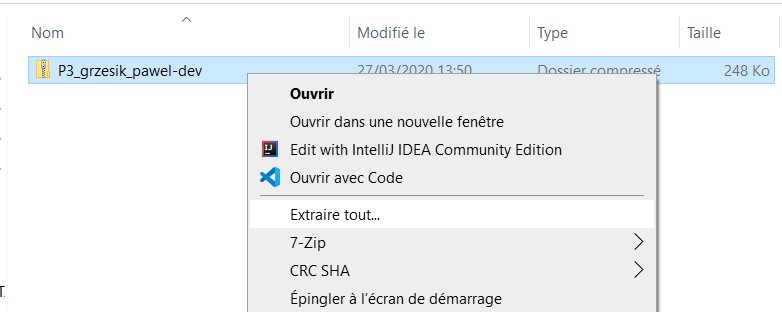
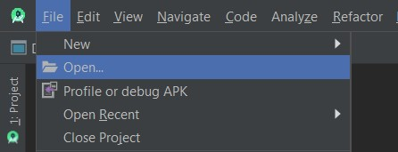
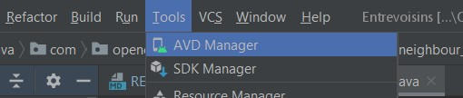
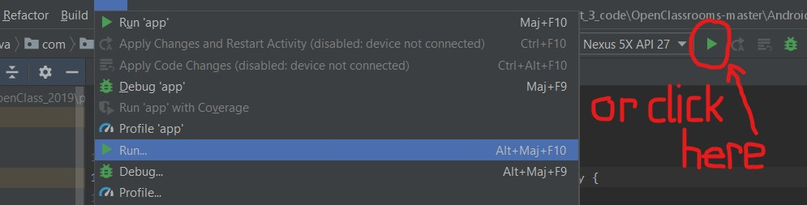
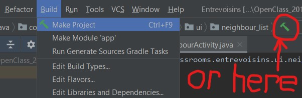

# Application : "Entrevoisins"

This project was generated with :
* [Android Studio](https://developer.android.com/studio) 3.6.1 ([Install](https://developer.android.com/studio/install) it if You need.)
* [Gradle](https://gradle.org/) version 5.6.4
* [Gradle plugin]() version 3.6.1
(You can check [on this link the compatibility](https://developer.android.com/studio/releases/gradle-plugin.html#updating-gradle) between Gradle and Gradle plugin). 
* The remote repository you can find at this address [https://github.com/Pamento/P3_grzesik_pawel](https://github.com/Pamento/P3_grzesik_pawel)

## Get the project on your computer ...

You can get it by clone it, or by downloading the zip file,
like we can see this proposition in the page of GitHub repository:

---
### 1. ... by cloning the repository from [**GitHub**](https://github.com/)

In Android Studio use the function added in for this purpose.
The image below show the way:

And after follow the instruction in the popup windows.

If You need added the git tool in Your local device,
You can find some information how to do it in [this page on StackOverflow](https://stackoverflow.com/questions/37093723/how-to-add-an-android-studio-project-to-github/44788350).

### 2. ... by download an Zip file

After downland zip file, Your unZip them in folder of Your choice and then open it.

___

## Open project

By click on File->Open You can get the project form folder created in previous action.

___

## Run project

  * Add an Virtual Device Android
    
If You don't have Your Android device,
in AVD Manager You can created the emulator if device like phone or tablet or others according to Your need.

___
More information You can find in official documentation: ['Build and run your app'](https://developer.android.com/studio/run)

  * Run project
    
By clicking the 'Run' method in Android Studio You start simulation of App witch one You work on.

___

## Build project

Wen Your work is don, and everyone is satisfy, it's time to publish Your app.
Here below is path to start build of APK witch can by publish.

___

For more information, please check official site : ['Publish your app'](https://developer.android.com/studio/publish)