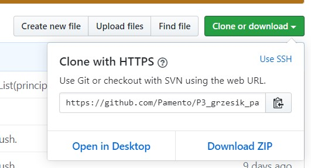
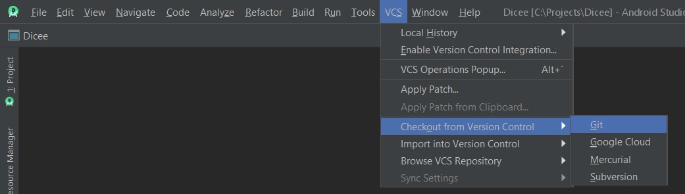

# Application : "Entrevoisins"

This project was generated with :
* [Android Studio](https://developer.android.com/studio) 3.6.1 ([Install](https://developer.android.com/studio/install) it if You need.)
* [Gradle](https://gradle.org/) version 5.6.4
* [Gradle plugin]() version 3.6.1
(You can check [on this link the compatibility](https://developer.android.com/studio/releases/gradle-plugin.html#updating-gradle) between Gradle and Gradle plugin). 
* The remote repository you can find at this address [https://github.com/Pamento/P3_grzesik_pawel](https://github.com/Pamento/P3_grzesik_pawel)

## Get the project on your computer

You can get it by clone it or by downloading the zip file,
like we can see this proposition in the page of GitHub repository:

### By cloning the repository from [**GitHub**](https://github.com/)

If You need added the git tool in Your local device,
You can find some information how to do it in [this page on StackOverflow](https://stackoverflow.com/questions/37093723/how-to-add-an-android-studio-project-to-github/44788350).